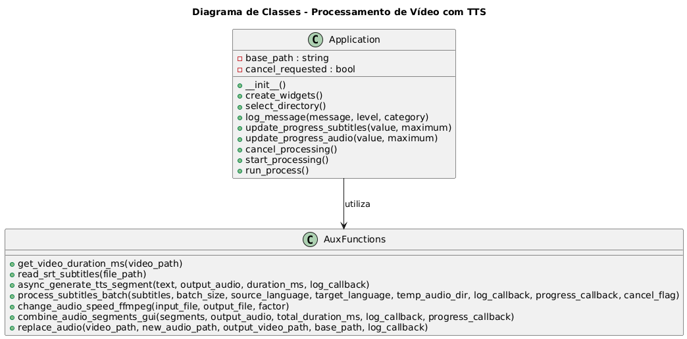
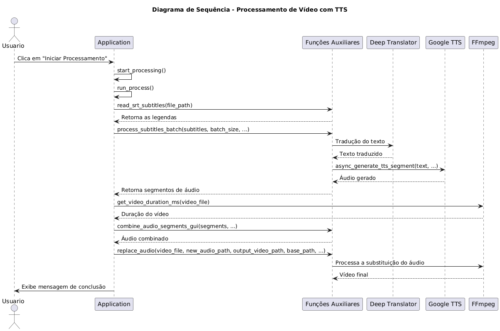

# Processamento de Vídeo com TTS em Lotes

Este projeto é uma ferramenta para processamento de vídeos que realiza a substituição de áudio utilizando TTS (Text-to-Speech) do Google, tradução de legendas e sincronização dos áudios com o vídeo original. A aplicação permite selecionar um diretório contendo um arquivo de vídeo (.mp4) e um arquivo de legendas (.srt), processa as legendas, gera áudios para cada trecho, combina os segmentos de áudio e substitui o áudio original do vídeo.

## Funcionalidades

-**Processamento de Legendas**: Leitura de arquivos SRT para extrair as legendas.

-**Tradução de Texto**: Tradução das legendas utilizando a biblioteca Deep Translator.

-**Geração de Áudio TTS**: Geração de áudio a partir do texto traduzido utilizando o Google TTS.

-**Sincronização de Áudio**: Combinação dos segmentos de áudio, ajustando cada trecho para que sincronize com o tempo da legenda.

-**Substituição de Áudio em Vídeo**: Remoção do áudio original do vídeo e inserção do novo áudio sincronizado.

-**Interface Gráfica**: Interface intuitiva feita com Tkinter para facilitar a utilização.

## Tecnologias e Bibliotecas Utilizadas

-**Python**: Linguagem de programação utilizada.

-**ffmpeg/ffprobe**: Ferramentas para processamento de áudio e vídeo.

-**gTTS**: Biblioteca para geração de áudio via Google TTS.

-**pydub**: Manipulação e processamento de arquivos de áudio.

-**pysrt**: Leitura e manipulação de arquivos de legendas no formato SRT.

-**deep-translator**: Tradução de textos entre diferentes idiomas.

-**Tkinter**: Criação da interface gráfica.

-**Asyncio**: Processamento assíncrono para otimizar as tarefas.

## Requisitos

- Python 3.7 ou superior.
- ffmpeg instalado e configurado no PATH.
- As seguintes bibliotecas Python (instaláveis via pip):

  - ffmpeg-python
  - gTTS
  - pydub
  - pysrt
  - deep-translator
  - Tkinter (geralmente incluído na instalação padrão do Python)

### Instalação das Dependências

Utilize o `pip` para instalar as dependências necessárias:

```bash

pip install ffmpeg-python gTTS pydub pysrt deep-translator

```

## Como Usar

1.**Clone o repositório:**

```bash

   git clone https://github.com/angelojbgama/VideoTTS-Syncer.git

```

2.**Acesse o diretório do projeto:**

```bash

   cd VideoTTS-Syncer

```

3.**Execute o script principal:**

```bash

   python main.py

```

4.**Utilize a Interface Gráfica:**

- Selecione o diretório base onde estão os arquivos `.mp4` e `.srt`.
- Configure o *batch size* e os idiomas para as legendas e tradução.
- Clique em **"Iniciar Processamento"** e acompanhe os logs e barras de progresso.
- Caso necessário, utilize o botão **"Cancelar"** para interromper o processamento.

## Estrutura do Projeto

-**main.py**: Arquivo principal contendo todo o código de processamento.

-**README.md**: Este arquivo com informações e instruções do projeto.

- Pastas e arquivos gerados:

  - Diretório temporário para armazenamento dos segmentos de áudio.
  - Arquivos de saída, como o áudio final e o vídeo com o novo áudio sincronizado.

## Contribuições

Contribuições são sempre bem-vindas!

Se você encontrar algum problema ou tiver sugestões para melhorias, por favor, abra uma _issue_ ou envie um _pull request_.

## Licença

Este projeto está licenciado sob a [MIT License](LICENSE).

## Contato

Para dúvidas ou sugestões, entre em contato através do e-mail: [angelojbgama@gmail.com](mailto:angelojbgama@gmail.com)

### Diagrama de Classes



### Diagrama de Sequência

